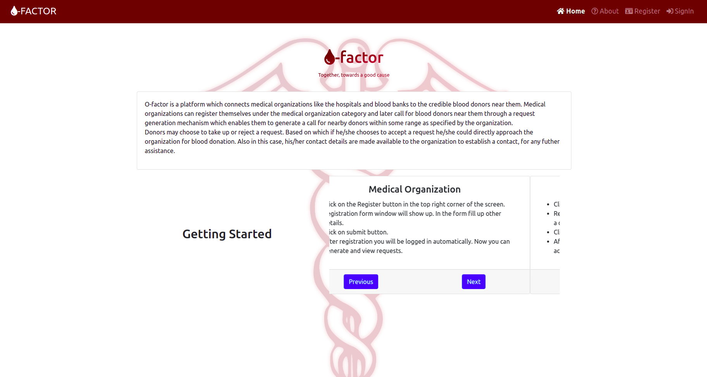

# [O-Factor 🔗](https://ofactor.netlify.app/home)

<!-- 

 -->

 

# Project Description

O-factor is a platform which connects medical organizations like the hospitals and blood banks to the credible blood donors near them. Medical organizations can register themselves under the medical organization category and later call for blood donors near them through a request generation mechanism which enables them to generate a call for nearby donors within some range as specified by the organization.
Donors may choose to take up or reject a request. Based on which if he/she chooses to accept a request he/she could directly approach the organization for blood donation. Also in this case, his/her contact details are made available to the organization to establish a contact, for any futher assistance.

 

# Features Implemented

## 1. Frontend

1. All **required** frontend designs are built and are available on different routes (Some of them are still to be integrated with the backend for funcionality). All designs are available here on this [link](https://xd.adobe.com/view/569ca051-2561-4693-b97b-35a37b8b8b4c-03cf/). These designs include the following:

   - Landing Page
   - Login/Signup Page
   - Profile Page
   - Inbox
   - Request Generation
   - Requests Status Panel

2. User Authentication has been integrated into the frontend.
3. Maps API has been integrated into the frontend.
4. Navgation has been setup and is in working state.

# Technologies and Packages Used

## 1. Frontend

1. React
2. Bootstrap
3. Google Maps API

## 2. Backend

1. Node
2. Express
3. MongoDB
4. Mongoose
5. JWT
6. Bcryptjs

 

# Local Setup

Clone the frontend and backend repositories, cd into them individually, and then follow the below mentioned steps for setting up backend and frontend seprately.

## 1. Frontend

1. Run `npm install`.
2. Generate your Map API key using this [link](https://console.cloud.google.com/google/maps-apis/overview?pli=1) and replace it with the keys in index.html & Map.js files of frontend.
3. Change backend port in App.js file if you change it in backend, by default the backend is setup to run on port 8000.

## 2. Backend

1. Run `npm install`.
2. We used MongoDB Atlas for hosted database, you can have a local database if you want but we recommend using Atlas. If you are using Atlas replace your database link in keys.js file of backend.
3. Set your JWT secret in keys.js file of backend.

Run `npm start` in the Backend repo first and then in Frontend .

 
